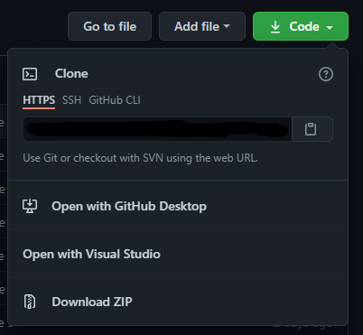
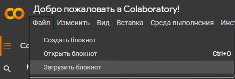

# Данный репозиторий создан для дисциплины "Машинное обучение и анализ данных"  

Можете поставить звездочку и подписаться на автора, также вы можете [закинуть монетку](https://www.tinkoff.ru/sl/4PRJdHGkGFo)  
Мне будет приятно <3

# Инструкция по установке
Чтобы скачать себе репозиторий, тыкните на зеленую кнопку и снизу download ZIP  

Затем заходите в [colab](https://colab.research.google.com/) (нужент аккаунт Google) и нажимаете на "Файл -> Загрузить блокнот", загружаете файл блокнота .ipynb (все файлы у меня подписаны как main.ipynb)  
  
В самих файлах ставите значения указанные у вас в задании
