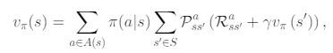
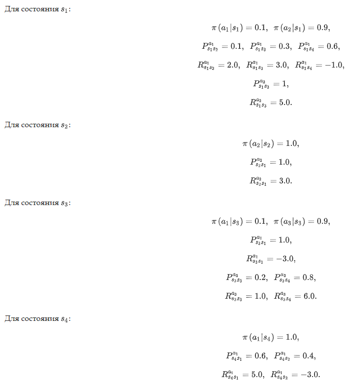

## 11 Упражнение  
Тут нет какого то универсального решения, поэтому дам формулу и пример свой  
**Строго рекомендую использовать [wolframalpha](https://www.wolframalpha.com/) для расчетов**  
  
  
  
Формула которую будете использовать для решения  
_Также можно воспользоваться [текстовым материалом](https://courses.openedu.ru/courses/course-v1:ITMOUniversity+MLDATAN+spring_2021_ITMO_bac/pdfbook/0/)_  
_Глава 11-12_  
_Страница 36_  

  
Берете свои значения и вносите в формулу  

V(S1) = 0.1(0.1(2+0.8V(S2))+0.3(3+0.8V(S3))+0.6(-1+0.8V(S4))+0.9(1(5+0.8V(S3))  
Пример на [wolfram](https://www.wolframalpha.com/input/?i=0.1%280.1%282%2B0.8x%29%2B0.3%283%2B0.8y%29%2B0.6%28-1%2B0.8z%29%29%2B0.9%281%285%2B0.8y%29%29)  
_В моем случае_  
V(S2) - x  
V(S3) - y  
V(S4) - z  

_Считать придется много и довольно долго_